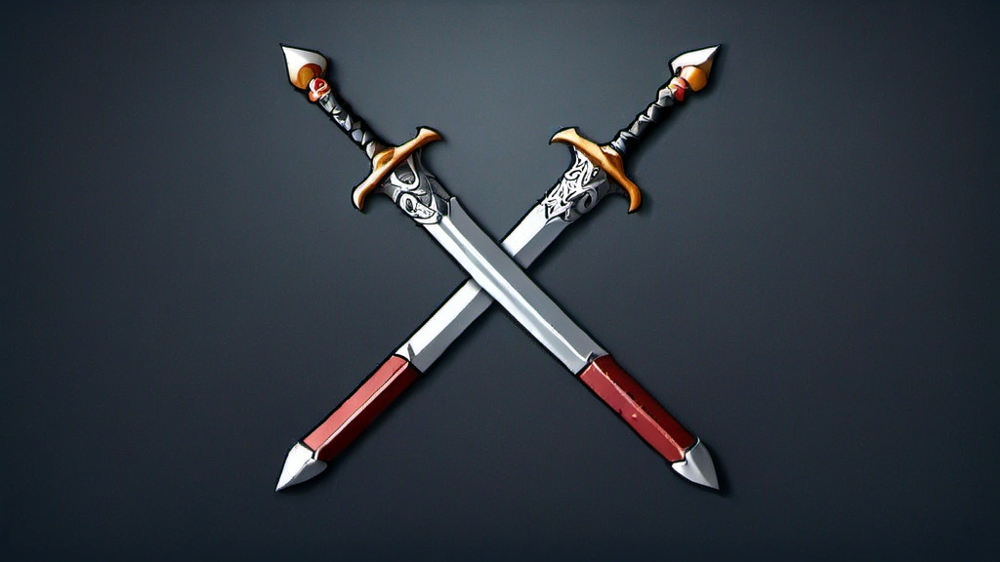
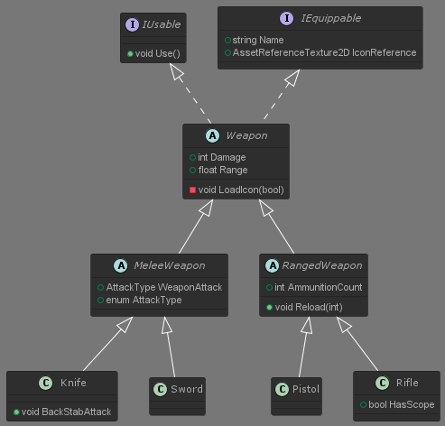
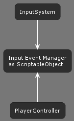
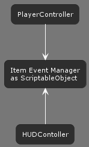

# **Weaponry System**

This project is a simple universal template for a weaponry system that can be used in a Unity game.

## **Stack**

Unity, C#, UI Toolkit, InputSystem, Addressables.

## **Features**

#### **Extensible architecture**

The system uses the OOP principles to promote extesibility. At the core of the system are interfaces and abstract classes for general weapon types that can serve as the base for specific items used in the game. It creates the following hierarchy of classes:

#### **Loading assets via Addressables**

The system makes use of the Unity's Addressables which allow to save memory by loading the necessary assets (e.g. textures, meshes, etc.) only when needed and unloading them, when they are no longer used. As an example I implemented weapon icons for the HUD as Addressables.

#### **Modern input and UI**

The system uses the new Unity InputSystem as well as the UI Toolkit for HUD, providing the most up-to-date solutions in these areas.

#### **Scriptable objects as the middleman**

The system includes the basis for the input and HUD managers. These crucial parts of the game are often implemented using the Singleton pattern, however, it can lead to a lot of downsides and high coupling. Therefore, I decided to use ScriptableObjects as event managers (following [this example](https://www.youtube.com/watch?v=WLDgtRNK2VE) by Unity) that serve as connectors between and systems without the need of the classes to know about one another.

The Input Event Manager serves as a hub for input events from the Unity's InputSystem and exposes UnityActions that other classes (e.g. Player) can subscribe to and execute their specific methods. For example, when the mouse button is clicked, the Input Event Manager invokes the AttackEvent, which the PlayerController subscribes to and calls its Attack() method.

The Item Event Manager gathers events related to item usage or change and, in a similar manner, exposes Actions that other classes (e.g. HUDController) can subscribe to and react accordingly.

## **Credits**

Created by Wojciech Grodzicki.

- Sample weapon icons by Navidtbt via Unity Asset Store ([melee](https://assetstore.unity.com/packages/2d/gui/icons/game-weapon-icons-package-285331), [ranged](https://assetstore.unity.com/packages/2d/gui/icons/gun-icons-package-287096))
